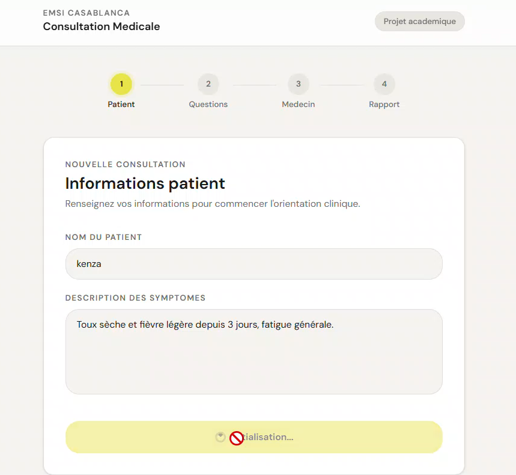
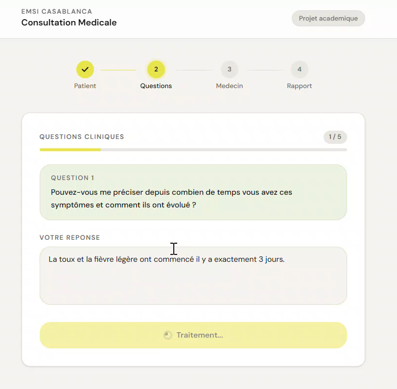
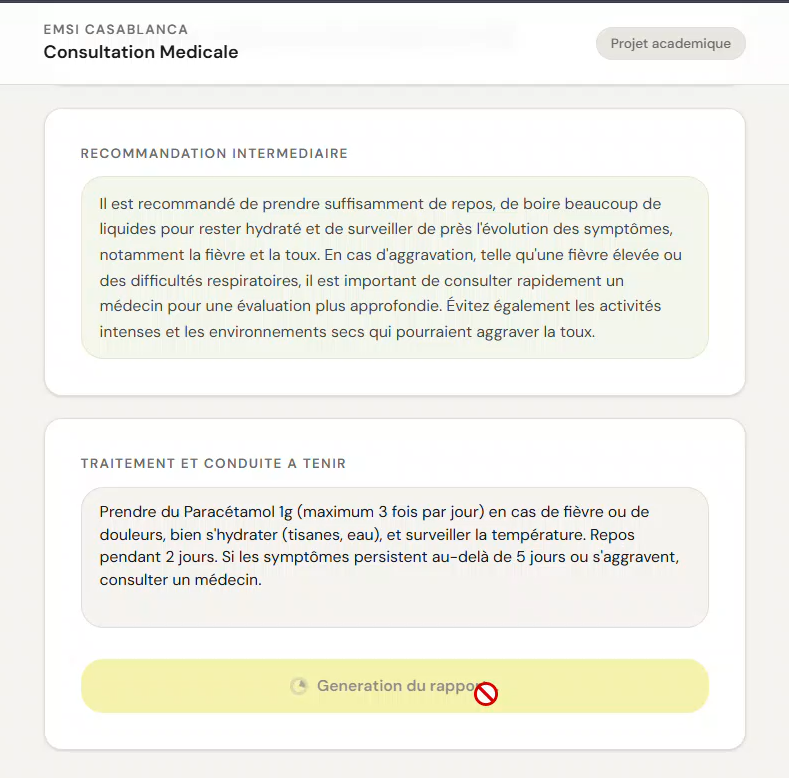
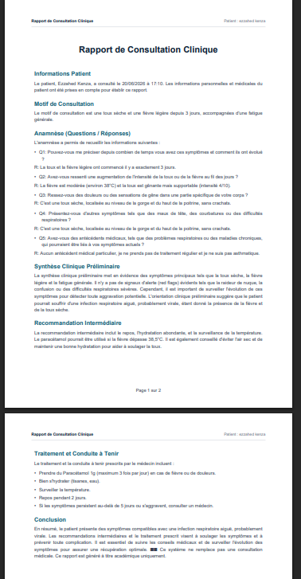
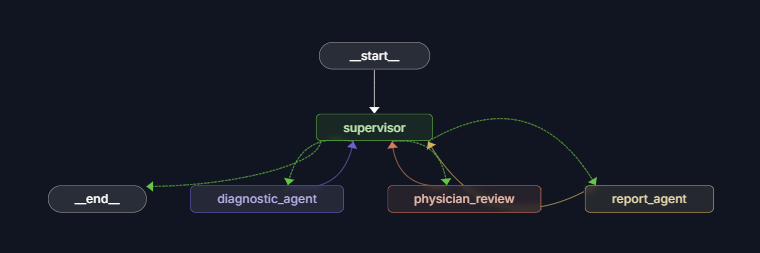
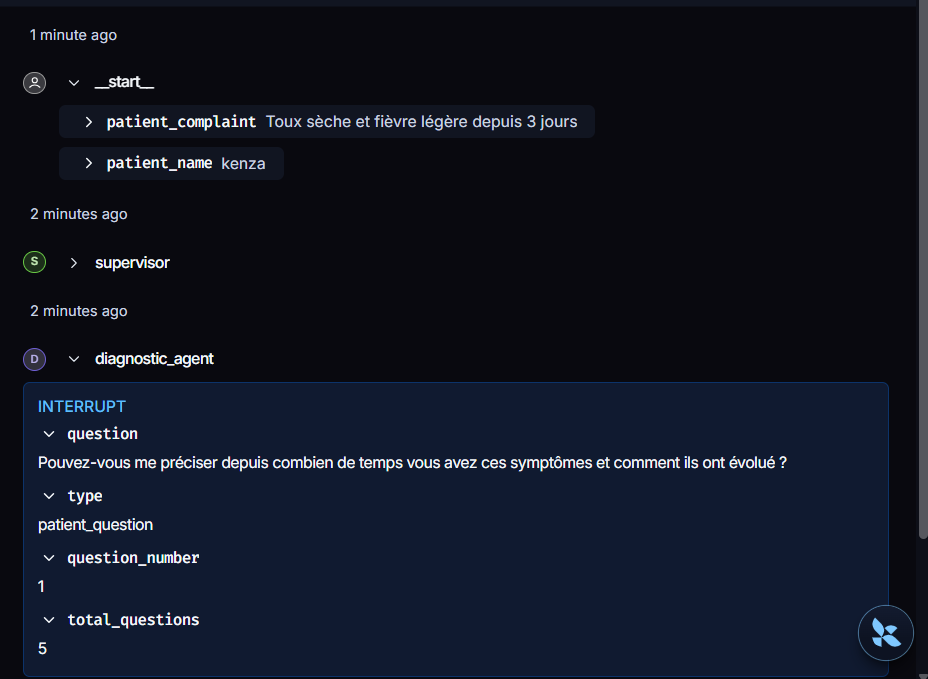
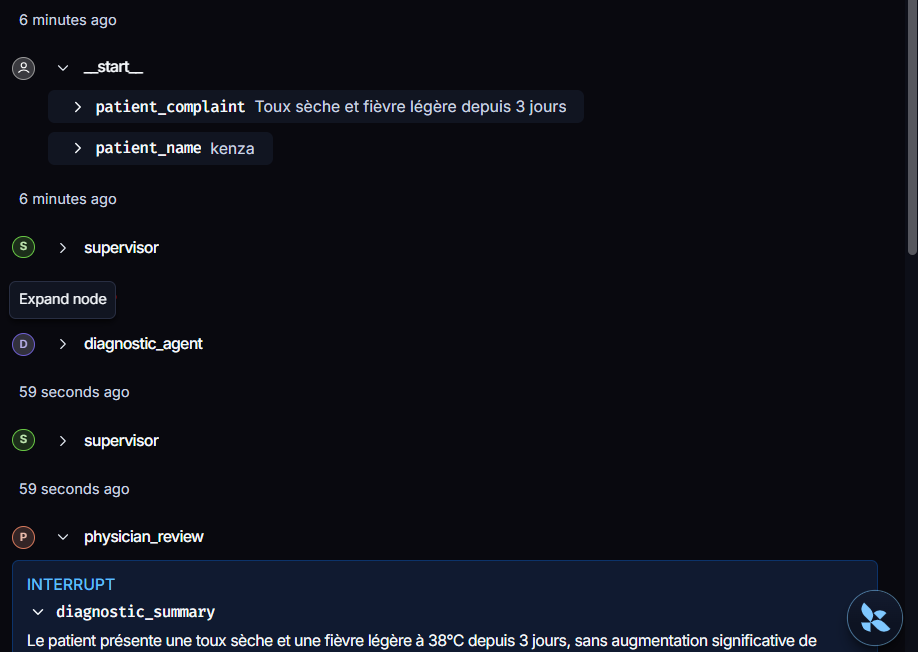
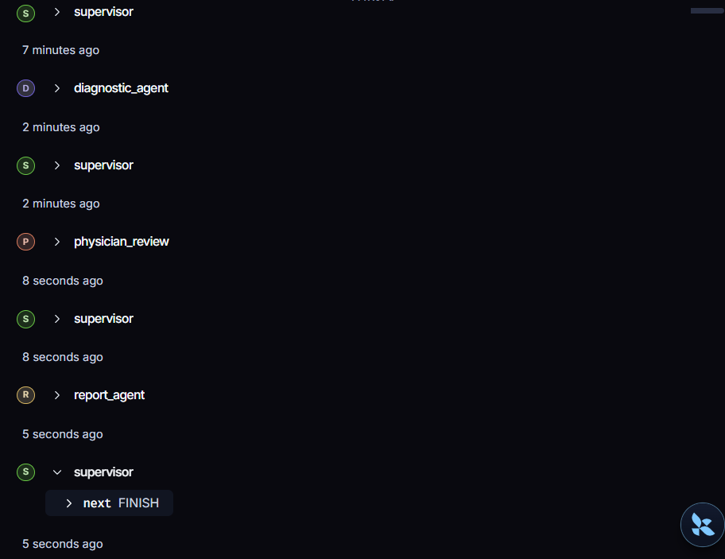

# MedFlow-Agents : Systeme de Consultation Medicale Multi-Agents

[](https://www.python.org/)
[](https://nextjs.org/)
[](https://fastapi.tiangolo.com/)
[](https://github.com/langchain-ai/langgraph)
[](https://opensource.org/licenses/MIT)

Projet academique realise a l'EMSI Casablanca (Ecole Marocaine des Sciences de l'Ingenieur) dans le cadre du module Systemes Multi-Agents. 

Ce projet implemente un systeme d'orientation clinique preliminaire automatise base sur une architecture multi-agents orchestree par LangGraph, dote d'interruptions humaines natives (Human-in-the-Loop) pour le patient et le medecin traitant, et d'un serveur d'outils externes utilisant le protocole MCP (Model Context Protocol).

---

## Architecture du Graphe (Workflow)

L'orchestration est pilotee de facon deterministe par un agent Supervisor qui oriente l'etat partage (MedicalState) vers les agents specialises en fonction des donnees accumulees.


---

## Captures d'ecran

Voici les captures d'ecran illustrant le fonctionnement de l'application et les etapes dans LangGraph Studio.

### Interface Utilisateur (Next.js)

* **Ecran 1 — Saisie du Cas Patient :**
  

* **Ecran 2 — Questions Medicales (Q/R) :**
  

* **Ecran 3 — Revue Medecin Traitant :**
  

* **Ecran 4 — Rapport Final :**
  

### Visualisation dans LangGraph Studio

* **Vue Globale du Graphe (Figure 5) :**
  

* **Interruption Patient (Figure 6) :**
  

* **Interruption Medecin (Figure 7) :**
  

* **Etat Final (Figure 8) :**
  

---

## Technologies Utilisees

* **Backend & Intelligence Artificielle :**
  * LangGraph & LangChain : Modelisation du workflow d'agents et gestion d'etat partage persistant (SqliteSaver).
  * FastAPI & Uvicorn : Exposition des routes de consultation et gestion asynchrone des interruptions.
  * Groq API / LLaMA-3.3-70b-versatile : Modele de langage a basse latence (temperature a 0 pour assurer la coherence au rejeu).
  * Model Context Protocol (MCP) : Serveur d'outils fournissant des recommandations cliniques de reference par mot-cle.
* **Frontends :**
  * Next.js 15 (React, TypeScript & Tailwind CSS) : Interface web premium monopage animee et reactive.
  * Streamlit : Prototype d'interface ecrit en Python pur pour tests rapides.
* **Documentation & Rapports :**
  * ReportLab : Generateur Python de rapport technique PDF (generate_report_pdf.py).
  * LaTeX : Source du rapport academique (Rapport_Technique_Systeme_Medical.tex).

---

## Structure du Projet

```text
├── backend/
│   ├── app/
│   │   ├── nodes/          # Codes des agents (supervisor, diagnostic, physician, report)
│   │   ├── tools/          # Outils internes et client MCP
│   │   ├── api.py          # Endpoints FastAPI de la consultation
│   │   ├── graph.py        # Assemblage et compilation du StateGraph
│   │   └── state.py        # Definition de l'etat partage MedicalState
│   ├── langgraph.json      # Configuration LangGraph Studio
│   └── requirements.txt
├── mcp_server/
│   ├── server.py           # Serveur MCP - Guidelines cliniques
│   └── requirements.txt
├── frontend/
│   ├── app.py              # Prototype Streamlit
│   └── requirements.txt
├── frontend2/
│   ├── app/                # Frontend Next.js (App Router)
│   └── package.json
└── documentation/
    ├── Rapport_Technique_Systeme_Medical.pdf  # Rapport de projet academique (export PDF depuis Overleaf)
    └── images/             # Emplacement des captures d'ecran du projet (Studio et UI)
```

---

## Installation et Lancement

### 1. Cloner le projet
```cmd
git clone https://github.com/votre-nom/medical-project.git
cd medical-project
```

### 2. Lancer le Serveur MCP (Port 8001)
Le serveur MCP fournit des directives cliniques d'orientation d'urgence.
```cmd
cd mcp_server
python -m venv venv
venv\Scripts\activate
pip install -r requirements.txt
python server.py
```

### 3. Configurer et Lancer le Backend (Port 8000)
1. Allez dans le répertoire `backend` :
   ```cmd
   cd ../backend
   ```
2. Créez un fichier `.env` à partir de `.env.example` et renseignez votre clé d'API Groq :
   ```env
   GROQ_API_KEY=votre_cle_groq
   LLM_MODEL=llama-3.3-70b-versatile
   MCP_SERVER_URL=http://localhost:8001
   ```
3. Créez l'environnement virtuel et lancez le backend :
   ```cmd
   python -m venv venv
   venv\Scripts\activate
   pip install -r requirements.txt
   python main.py
   ```

### 4. Lancer le Frontend Next.js (Port 3000)
L'application Next.js est l'interface principale.
```cmd
cd ../frontend2
npm install
npm run dev
```
Accédez à l'application sur http://localhost:3000.

---

## Utilisation de LangGraph Studio

LangGraph Studio permet de visualiser graphiquement le graphe en temps réel et de déboguer l'état de la mémoire.

1. Installez le package CLI dans le venv du backend :
   ```cmd
   cd backend
   venv\Scripts\activate
   pip install -U "langgraph-cli[inmem]"
   ```
2. Lancez le serveur de développement de LangGraph Studio :
   ```cmd
   langgraph dev
   ```
3. Ouvrez le lien généré dans votre navigateur pour visualiser le graphe et tester les interruptions pas à pas.

---

## Cadre Ethique et Mention Legale

Ce projet est un travail d'etude academique et n'a pas fait l'objet d'une certification reglementaire de dispositif medical. 
* Il ne fournit aucun diagnostic definitif et se limite a de l'orientation clinique preliminaire.
* Il exige systematiquement une validation humaine par un medecin traitant habilite avant de formaliser le rapport final.
* Les rapports generes comportent obligatoirement la mention d'avertissement reglementaire : "Ce systeme ne remplace pas une consultation medicale. Ce rapport est genere a titre academique uniquement."
