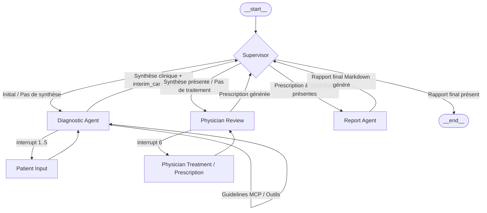

# MedFlow-Agents : Système de Consultation Médicale Multi-Agents 🏥

[](https://www.python.org/)
[](https://nextjs.org/)
[](https://fastapi.tiangolo.com/)
[](https://github.com/langchain-ai/langgraph)
[](https://opensource.org/licenses/MIT)

Projet académique réalisé à l'**EMSI Casablanca** (École Marocaine des Sciences de l'Ingénieur) dans le cadre du module **Systèmes Multi-Agents**. 

Ce projet implémente un système d'orientation clinique préliminaire automatisé basé sur une architecture multi-agents orchestrée par **LangGraph**, doté d'interruptions humaines natives (Human-in-the-Loop) pour le patient et le médecin traitant, et d'un serveur d'outils externes utilisant le protocole **MCP** (Model Context Protocol).

---

## Architecture du Graphe (Workflow)

L'orchestration est pilotée de façon déterministe par un agent **Supervisor** qui oriente l'état partagé (`MedicalState`) vers les agents spécialisés en fonction des données accumulées.



---

##  Technologies Utilisées

* **Backend & Intelligence Artificielle :**
  * **LangGraph** & **LangChain** : Modélisation du workflow d'agents et gestion d'état partagé persistant (`SqliteSaver`).
  * **FastAPI** & **Uvicorn** : Exposition des routes de consultation et gestion asynchrone des interruptions.
  * **Groq API / LLaMA-3.3-70b-versatile** : Modèle de langage à basse latence (température à 0 pour assurer la cohérence au rejeu).
  * **Model Context Protocol (MCP)** : Serveur d'outils fournissant des recommandations cliniques de référence par mot-clé.
* **Frontends :**
  * **Next.js 15 (React, TypeScript & Tailwind CSS)** : Interface web premium monopage animée et réactive.
  * **Streamlit** : Prototype d'interface écrit en Python pur pour tests rapides.
* **Documentation & Rapports :**
  * **ReportLab** : Générateur Python de rapport technique PDF (`generate_report_pdf.py`).
  * **LaTeX** : Source du rapport académique (`Rapport_Technique_Systeme_Medical.tex`).

---

## Structure du Projet

```text
├── backend/
│   ├── app/
│   │   ├── nodes/          # Codes des agents (supervisor, diagnostic, physician, report)
│   │   ├── tools/          # Outils internes et client MCP
│   │   ├── api.py          # Endpoints FastAPI de la consultation
│   │   ├── graph.py        # Assemblage et compilation du StateGraph
│   │   └── state.py        # Définition de l'état partagé MedicalState
│   ├── langgraph.json      # Configuration LangGraph Studio
│   └── requirements.txt
├── mcp_server/
│   ├── server.py           # Serveur MCP - Guidelines cliniques
│   └── requirements.txt
├── frontend/
│   ├── app.py              # Prototype Streamlit
│   └── requirements.txt
├── frontend2/
│   ├── app/                # Frontend Next.js (App Router)
│   └── package.json

```

---

##  Installation et Lancement

### 1. Cloner le projet
```cmd
git clone https://github.com/votre-nom/medical-project.git
cd medical-project
```

### 2. Lancer le Serveur MCP (Port 8001)
Le serveur MCP fournit des directives cliniques d'orientation d'urgence.
```cmd
cd mcp_server
python -m venv venv
venv\Scripts\activate
pip install -r requirements.txt
python server.py
```

### 3. Configurer et Lancer le Backend (Port 8000)
1. Allez dans le répertoire `backend` :
   ```cmd
   cd ../backend
   ```
2. Créez un fichier `.env` à partir de `.env.example` et renseignez votre clé d'API Groq :
   ```env
   GROQ_API_KEY=votre_cle_groq
   LLM_MODEL=llama-3.3-70b-versatile
   MCP_SERVER_URL=http://localhost:8001
   ```
3. Créez l'environnement virtuel et lancez le backend :
   ```cmd
   python -m venv venv
   venv\Scripts\activate
   pip install -r requirements.txt
   python main.py
   ```

### 4. Lancer le Frontend Next.js (Port 3000)
L'application Next.js est l'interface principale.
```cmd
cd ../frontend2
npm install
npm run dev
```
Accédez à l'application sur [http://localhost:3000](http://localhost:3000).

---

##  Utilisation de LangGraph Studio

LangGraph Studio permet de visualiser graphiquement le graphe en temps réel et de déboguer l'état de la mémoire.

1. Installez le package CLI dans le venv du backend :
   ```cmd
   cd backend
   venv\Scripts\activate
   pip install -U "langgraph-cli[inmem]"
   ```
2. Lancez le serveur de développement de LangGraph Studio :
   ```cmd
   langgraph dev
   ```
3. Ouvrez le lien généré dans votre navigateur pour visualiser le graphe et tester les interruptions pas à pas.

---

## ⚠️ Cadre Éthique et Mention Légale

Ce projet est un travail d'étude académique et n'a pas fait l'objet d'une certification réglementaire de dispositif médical. 
* Il ne fournit aucun diagnostic définitif et se limite à de l'**orientation clinique préliminaire**.
* Il exige systématiquement une **validation humaine** par un médecin traitant habilité avant de formaliser le rapport final.
* Les rapports générés comportent obligatoirement la mention d'avertissement réglementaire : *"Ce système ne remplace pas une consultation médicale. Ce rapport est généré à titre académique uniquement."*
